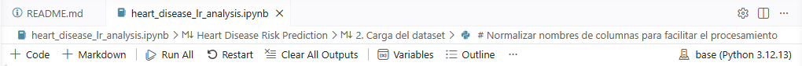
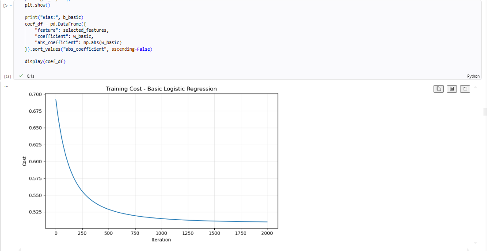
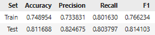

# Heart Disease Risk Prediction — Logistic Regression Homework

## Carlos Avellaneda

## Exercise Summary

This project implements logistic regression **from scratch** (NumPy only, no scikit-learn for
model training) to predict the presence of heart disease from clinical patient data. The work
covers the full pipeline requested in the assignment:

- Exploratory data analysis (missing values, duplicates, outlier screening, class balance).
- A hand-built sigmoid function, binary cross-entropy cost, and gradient descent, trained on a
  manually implemented stratified 70/30 train/test split.
- Visualization of linear decision boundaries for three feature pairs (`age`–`chol`,
  `trestbps`–`thalach`, `oldpeak`–`ca`).
- L2 regularization added to the cost and gradient functions, with λ tuned over
  `[0, 0.001, 0.01, 0.1, 1]`.
- Training and testing of the final model in Amazon SageMaker (AWS Academy), using the same
  train/test split and preprocessing produced locally, **without creating or deploying an
  endpoint**.

All steps, metrics, plots, and interpretation are in [`heart_disease_lr_analysis.ipynb`](./heart_disease_lr_analysis.ipynb).

## Dataset Description

- **Name:** Heart Disease Dataset (UCI Cleveland collection, Kaggle mirror).
- **Source:** https://www.kaggle.com/datasets/neurocipher/heartdisease
- **Records:** 303 patients, 14 clinical attributes plus the binary target
  (`1` = disease present, `0` = disease absent).
- **Features used for modeling (6, as required by the assignment):** `age`, `chol` (serum
  cholesterol), `trestbps` (resting blood pressure), `thalach` (maximum heart rate achieved),
  `oldpeak` (ST depression induced by exercise), and `ca` (number of major vessels colored by
  fluoroscopy).

> To reproduce the notebook locally: download the CSV from the Kaggle link above and place it in
> the same folder as `heart_disease_lr_analysis.ipynb` before running it — the notebook
> auto-detects the CSV file in its working directory.

## Requirements

- Python 3
- NumPy
- Pandas
- Matplotlib

## How to Run

1. Clone this repository.
2. Install the dependencies: `pip install numpy pandas matplotlib`.
3. Open `heart_disease_lr_analysis.ipynb` in Jupyter and run all cells.

## Main Result

The dataset contains 303 patient records with no missing values and a single duplicate row (left
in place, as it does not meaningfully affect the split). A logistic regression model trained from
scratch on six standardized clinical features (`age`, `chol`, `trestbps`, `thalach`, `oldpeak`,
`ca`) reaches ~75% train accuracy and ~78% test accuracy (F1 ≈ 0.82), with no sign of overfitting.
Decision-boundary visualizations on feature pairs confirm the same importance pattern seen in the
model's coefficients: `oldpeak`/`ca` separate the two classes far better than `age`/`chol`. L2
regularization barely moves test accuracy or F1 as λ increases, indicating the unregularized model
was not strongly overfitting to begin with; λ = 0.001 is selected as a low-cost safeguard against
overfitting on unseen data.

## SageMaker Training and Testing

The notebook (`heart_disease_lr_analysis.ipynb`) and the dataset (`heart.csv`) were uploaded to a
notebook instance in the AWS Academy Learner Lab SageMaker environment. **No endpoint or model
deployment service was created or used**, per the account limitation for this course.

### Environment

*Fill in your notebook instance / domain / kernel details here (e.g. instance type, kernel name),
then add a screenshot showing the SageMaker notebook open with that environment visible.*

### Process

The same code used for the local run was executed unmodified inside the SageMaker notebook: data
loading/cleaning, feature standardization, gradient descent training of the logistic regression
model, and evaluation on the held-out test set.

*Add a screenshot of the training cell running (or the cost-vs-iteration plot) confirming the
training loop ran to completion inside SageMaker.*

### Test Results

| Set | Accuracy | Precision | Recall | F1 |
|---|---:|---:|---:|---:|
| Train | 0.748954 | 0.733831 | 0.801630 | 0.766234 |
| Test | 0.811688 | 0.824675 | 0.803797 | 0.814103 |

### Comparison with Local Execution

*Compare the metrics obtained in SageMaker above against the local results reported in
"Main Result" (train accuracy ≈ 0.75 / test accuracy ≈ 0.78, λ = 0.001). Note whether they match
and, if not, what might explain the difference (data used, random seed, number of iterations,
etc.).*

-

## Repository Contents

- `heart_disease_lr_analysis.ipynb` — end-to-end notebook (EDA, model implementation,
  visualization, regularization, SageMaker data preparation).
- `README.md` — this file.
- `heart.csv` — dataset used to run the notebook (or place your own downloaded copy here).
- `images/` — SageMaker evidence screenshots (add this folder with your own screenshots before
  submitting: `image.png` for the environment, `image2.png` for the training process, `image3.png`
  for the test results).
